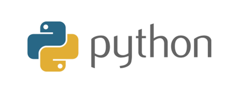
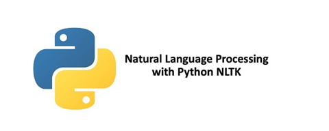
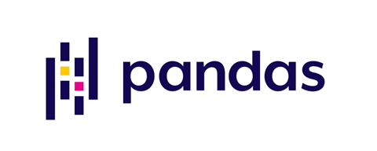
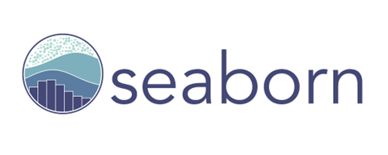
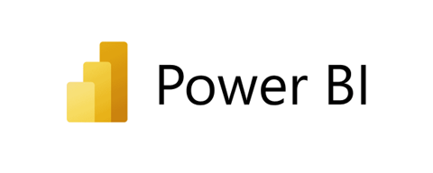
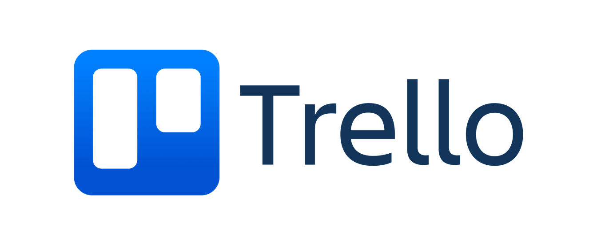
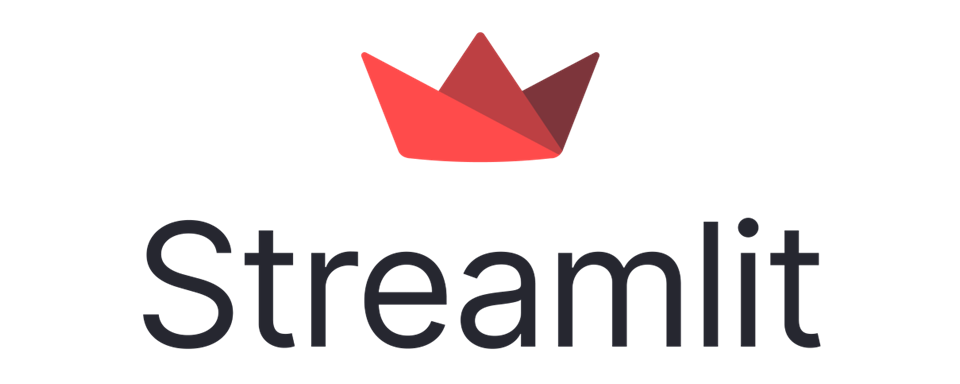

  

!

*** 
# 
Proyecto de Análisis y Consultoría para Inversión Gastrónomica

## Índice

  
Tabla de contenido

  1. [Índice](#índice)
  2. [Sobre el proyecto](#sobre-el-proyecto)
  3. [KPI](#kpi)
  4. [Tecnologías Seleccionadas](#tecnologías-seleccionadas)
  5. [PipeLine](#pipeline)
  6. [Cronología](#cronología)
  7. [Dashboard de Análisis](#dashboard-de-análisis)
  8. [Sistema de Recomendación](#sistema-de-recomendación)
  9. [Miembros del Equipo](#miembros-del-equipo)

## Sobre el proyecto

**Objetivo**

El objetivo principal de este proyecto es simular una firma de consultoría empresarial mientras participamos en un proyecto práctico. En este escenario, un cliente se acerca a nosotros para analizar las oportunidades de abrir un restaurante en algún lugar del estado de Florida.

**Alcance**

[FLORIDA]

Guía paso a paso

Paso 1: ETL (Extracción, Transformación y Carga)

Paso 2: Análisis Exploratorio de Datos (EDA)

Paso 3: Panel de control

Paso 4: Modelo de Recomendación

## KPI

1. KPI
..*Definición
..*Objetivo
3. KPI
..*Definición
..*Objetivo
5. KPI
..*Definición
..*Objetivo
7. KPI
..*Definición
..*Objetivo

## Tecnologías Seleccionadas

| [Python](https://www.python.org/doc/) | [Matplotlib](https://matplotlib.org/stable/contents.html) | [NLTK](https://www.nltk.org/) | [Pandas](https://pandas.pydata.org/pandas-docs/stable/index.html) | [Seaborn](https://seaborn.pydata.org/) | [Docker](https://docker.com/) |
| ------------------------ | ----------------------- | ----------------------- | ----------------------- | ----------------------- | ----------------------- |
|  |  |  |  |  |  |

| [Google Cloud](https://cloud.google.com/storage/docs?hl=es-419) | [Power BI](https://docs.microsoft.com/en-us/power-bi/) | [Trello](https://trello.com/) | [StreamLit](https://docs.streamlit.io/) | [AirFlow](https://airflow.apache.org/docs/) | [BigQuery](https://cloud.google.com/bigquery/docs?hl=es-419) |
| ----------------------- | ----------------------- | ----------------------- | ----------------------- | ----------------------- | ----------------------- |
|  |  |  |  |  |  |

## PipeLine

## Cronología

## Dashboard de Análisis
Propósito
El propósito principal de este Dashboard es proporcionar información clave del negocio de restaurantes en Florida, mostrando al mismo tiempo la competencia y las especializaciones en cada ubicación.

  
<b>Detalles claves</b>

  1. Visualizaciones interactivas: Explora los datos de manera dinámica a través de gráficos, diagramas y mapas interactivos.
  2. Filtros personalizables: Personaliza el tablero según tus necesidades específicas ajustando los filtros y parámetros.
  3. Actualizaciones en tiempo real: Accede a información e ideas actualizadas para tomar decisiones informadas.
  4. Interfaz fácil de usar: Navega por el tablero sin esfuerzo con un diseño intuitivo y fácil de usar.

<b>¿Cómo usarlo?</b>

<ul>
  <li>Para empezar, sigue estos pasos:</li>
  <ul>
    <li>Selecciona Filtros: Utiliza los menús desplegables o los deslizadores para personalizar los datos mostrados.</li>
    <li>Interactúa con las Visualizaciones: Pasa el ratón sobre los gráficos para obtener información detallada o haz clic en los elementos para filtrar más los datos.</li>
    <li>Explora las Pestañas: Navega entre diferentes secciones o pestañas para explorar varios aspectos de los datos.</li>
    <li>Exporta Datos: Exporta visualizaciones o tablas de datos para un análisis o informe más detallado.</li>
  </ul>
</ul>

## Sistema de Recomendación
El sistema de recomendación se basa en dos sistemas vinculados al usuario:

Identifica a tu Competencia

Comprender a tu Audiencia

Explora el modelo

## Miembros del Equipo

<table align="center">
  <tr>
    <td align="center"><b>Ignacio Arce</b></td>
    <td align="center"><b>Jorge Cabuya</b></td>
    <td align="center"><b>Alex Davila</b></td>
    <td align="center"><b>Sofia Jacky</b></td>
    <td align="center"><b>Patrick Mathay</b></td>
  </tr>
  <tr>
    <td align="center"></td>
    <td align="center"></td>
    <td align="center"></td>
    <td align="center"></td>
    <td align="center"></td>
  </tr>
  <tr>
    <td align="center">Data Engineer</td>
    <td align="center">ML Ops Engineer</td>
    <td align="center">Data Analyst</td>
    <td align="center">Data Analyst</td>
    <td align="center">Data Engineer</td>
  </tr>

  <tr>
    <td align="center"></td>
    <td align="center"></td>
    <td align="center"></td>
    <td align="center"></td>
    <td align="center"></td>
  </tr>
</table>
